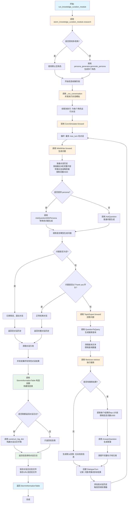

```mermaid
  flowchart TD
      A[开始: run_knowledge_curation_module] --> B[调用 storm_knowledge_curation_module.research]

      B --> C{是否禁用多视角?}
      C -->|是| D[使用默认空角色]
      C -->|否| E[调用 persona_generator.generate_persona<br/>生成多个角色]
      D --> F[开始信息收集阶段]
      E --> F

      F --> G[调用 _run_conversation<br/>并发执行对话模拟]

      G --> H[线程池执行: 为每个角色运行对话]
      H --> I[调用 ConvSimulator.forward]

      I --> J[循环: 最多 max_turn 轮对话]
      J --> K[调用 WikiWriter.forward<br/>生成问题]

      K --> L[准备对话历史<br/>保留最近4轮完整内容<br/>早期对话省略答案<br/>限制词数2500]
      L --> M{是否提供 persona?}
      M -->|是| N[调用 AskQuestionWithPersona<br/>带角色问题生成]
      M -->|否| O[调用 AskQuestion<br/>普通问题生成]
      N --> P[调用语言模型生成问题]
      O --> P
      P --> Q{问题是否为空?}
      Q -->|是| R[记录错误，退出对话]
      Q -->|否| S{问题是否以'Thank you'开头?}
      S -->|是| T[正常结束对话]
      S -->|否| U[调用 TopicExpert.forward<br/>回答问题]

      U --> V[调用 QuestionToQuery<br/>生成搜索查询]
      V --> W[清理查询文本<br/>限制查询数量]
      W --> X[调用 Retriever.retrieve<br/>执行搜索]
      X --> Y{是否有搜索结果?}
      Y -->|否| Z[生成默认回答: 无法找到信息]
      Y -->|是| AA[提取每个结果的top-1片段<br/>限制信息词数1000]
      AA --> AB[调用 AnswerQuestion<br/>生成答案]
      AB --> AC[清理不完整句子和引用]

      Z --> AD[创建 DialogueTurn<br/>记录: 问题/答案/查询/结果]
      AC --> AD
      AD --> AE[添加到对话历史<br/>触发回调处理器]
      AE --> J

      R --> AF[返回空对话历史]
      T --> AG[返回完整对话历史]

      AF --> AH[清理对话引用]
      AG --> AH
      AH --> AI[并发收集所有角色对话结果]
      AI --> AJ[调用 StormInformationTable 构造函数<br/>构建信息表]

      AJ --> AK{是否需要返回对话日志?}
      AK -->|是| AL[调用 construct_log_dict<br/>构建对话日志字典]
      AK -->|否| AM[只返回信息表]
      AL --> AN[返回信息表和对话日志]
      AM --> AN

      AN --> AO[保存对话日志到文件<br/>保存URL信息到文件]
      AO --> AP[返回 StormInformationTable]
      AP --> AQ[完成]

      style A fill:#e1f5fe
      style B fill:#fff3e0
      style G fill:#fff3e0
      style I fill:#fff3e0
      style K fill:#fff3e0
      style U fill:#fff3e0
      style X fill:#fff3e0
      style AJ fill:#e8f5e9
      style AN fill:#e8f5e9
      style AP fill:#e1f5fe
```  
