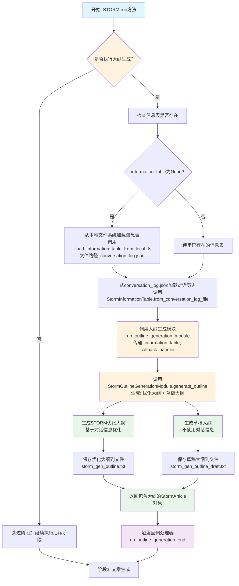

```mermaid
  flowchart TD
      A[开始: STORM run方法] --> B{是否执行大纲生成?}
      B -->|否| C[跳过阶段2: 继续执行后续阶段]
      B -->|是| D[检查信息表是否存在]

      D --> E{information_table为None?}
      E -->|是| F[从本地文件系统加载信息表<br/>调用_load_information_table_from_local_fs<br/>文件路径: conversation_log.json]
      E -->|否| G[使用已存在的信息表]

      F --> H[从conversation_log.json加载对话历史<br/>调用StormInformationTable.from_conversation_log_file]
      G --> H

      H --> I[调用大纲生成模块<br/>run_outline_generation_module<br/>传递: information_table, callback_handler]

      I --> J[调用StormOutlineGenerationModule.generate_outline<br/>生成: 优化大纲 + 草稿大纲]

      J --> K[生成STORM优化大纲<br/>基于对话信息优化]

      J --> L[生成草稿大纲<br/>不使用对话信息]

      K --> M[保存优化大纲到文件<br/>storm_gen_outline.txt]

      L --> N[保存草稿大纲到文件<br/>storm_gen_outline_draft.txt]

      M --> O[返回包含大纲的StormArticle对象]
      N --> O

      O --> P[触发回调处理器<br/>on_outline_generation_end]

      C --> Q[阶段3: 文章生成]
      P --> Q

      style A fill:#e1f5fe
      style B fill:#fff3e0
      style I fill:#fff3e0
      style J fill:#fff3e0
      style K fill:#e8f5e9
      style L fill:#e8f5e9
      style O fill:#e8f5e9
      style P fill:#f3e5f5
```
