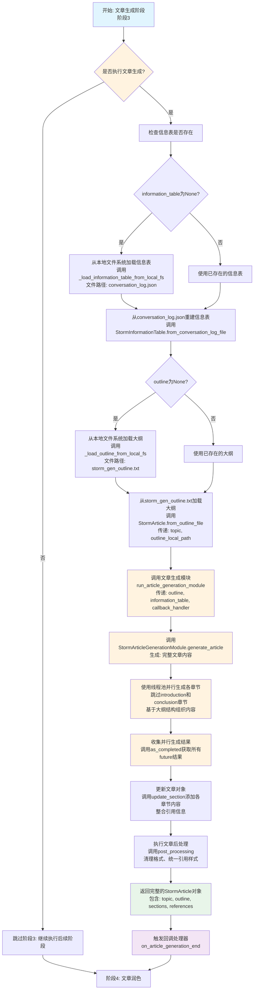

```mermaid
  flowchart TD
      A[开始: 文章生成阶段<br/>阶段3] --> B{是否执行文章生成?}
      B -->|否| C[跳过阶段3: 继续执行后续阶段]
      B -->|是| D[检查信息表是否存在]

      D --> E{information_table为None?}
      E -->|是| F[从本地文件系统加载信息表<br/>调用_load_information_table_from_local_fs<br/>文件路径: conversation_log.json]
      E -->|否| G[使用已存在的信息表]

      F --> H[从conversation_log.json重建信息表<br/>调用StormInformationTable.from_conversation_log_file]
      G --> H

      H --> I{outline为None?}
      I -->|是| J[从本地文件系统加载大纲<br/>调用_load_outline_from_local_fs<br/>文件路径: storm_gen_outline.txt]
      I -->|否| K[使用已存在的大纲]

      J --> L[从storm_gen_outline.txt加载大纲<br/>调用StormArticle.from_outline_file<br/>传递: topic, outline_local_path]
      K --> L

      L --> M[调用文章生成模块<br/>run_article_generation_module<br/>传递: outline, information_table, callback_handler]

      M --> N[调用StormArticleGenerationModule.generate_article<br/>生成: 完整文章内容]

      N --> O[使用线程池并行生成各章节<br/>跳过introduction和conclusion章节<br/>基于大纲结构组织内容]

      O --> P[收集并行生成结果<br/>调用as_completed获取所有future结果]

      P --> Q[更新文章对象<br/>调用update_section添加各章节内容<br/>整合引用信息]

      Q --> R[执行文章后处理<br/>调用post_processing<br/>清理格式、统一引用样式]

      R --> S[返回完整的StormArticle对象<br/>包含: topic, outline, sections, references]

      S --> T[触发回调处理器<br/>on_article_generation_end]

      C --> U[阶段4: 文章润色]
      T --> U

      style A fill:#e1f5fe
      style B fill:#fff3e0
      style M fill:#fff3e0
      style N fill:#fff3e0
      style O fill:#fff3e0
      style P fill:#fff3e0
      style S fill:#e8f5e9
      style T fill:#f3e5f5
```
