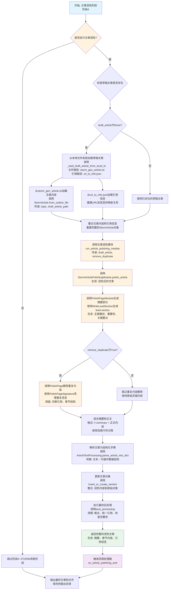

```mermaid
  flowchart TD
      A[开始: 文章润色阶段<br/>阶段4] --> B{是否执行文章润色?}
      B -->|否| C[跳过阶段4: STORM流程完成]
      B -->|是| D{检查草稿文章是否存在}

      D --> E{draft_article为None?}
      E -->|是| F[从本地文件系统加载草稿文章<br/>调用_load_draft_article_from_local_fs<br/>文件路径: storm_gen_article.txt<br/>引用路径: url_to_info.json]
      E -->|否| G[使用已存在的草稿文章]

      F --> H[从storm_gen_article.txt加载文章内容<br/>调用StormArticle.from_outline_file<br/>传递: topic, draft_article_path]
      F --> I[从url_to_info.json加载引用信息<br/>重建URL到信息的映射关系]

      H --> J[整合文章内容和引用信息<br/>重建完整的StormArticle对象]
      I --> J
      G --> J

      J --> K[调用文章润色模块<br/>run_article_polishing_module<br/>传递: draft_article, remove_duplicate]

      K --> L[调用StormArticlePolishingModule.polish_article<br/>生成: 润色后的文章]

      L --> M[调用PolishPageModule生成摘要部分<br/>使用WriteLeadSection生成lead section<br/>包含: 主题概述、重要性、关键要点]

      M --> N{remove_duplicate为True?}
      N -->|是| O[调用PolishPage删除重复内容<br/>使用PolishPageSignature清理重复信息<br/>保留: 内联引用、章节结构]
      N -->|否| P[跳过重复内容删除<br/>保持原始页面内容]

      O --> Q[组合摘要和正文<br/>格式: # summary + 正文内容<br/>使用双换行符分隔]
      P --> Q

      Q --> R[解析文章为结构化字典<br/>调用ArticleTextProcessing.parse_article_into_dict<br/>转换: 文本→可操作数据结构]

      R --> S[更新文章对象<br/>调用insert_or_create_section<br/>整合: 润色内容到原始对象]

      S --> T[执行最终后处理<br/>调用post_processing<br/>清理: 格式、统一引用、检查完整性]

      T --> U[返回完整的润色文章<br/>包含: 摘要、章节内容、引用信息]

      U --> V[触发回调处理器<br/>on_article_polishing_end]

      C --> W[输出最终文章到文件<br/>保存到输出目录]
      V --> W

      style A fill:#e1f5fe
      style B fill:#fff3e0
      style K fill:#fff3e0
      style L fill:#fff3e0
      style M fill:#fff3e0
      style O fill:#fff3e0
      style U fill:#e8f5e9
      style V fill:#f3e5f5
```
